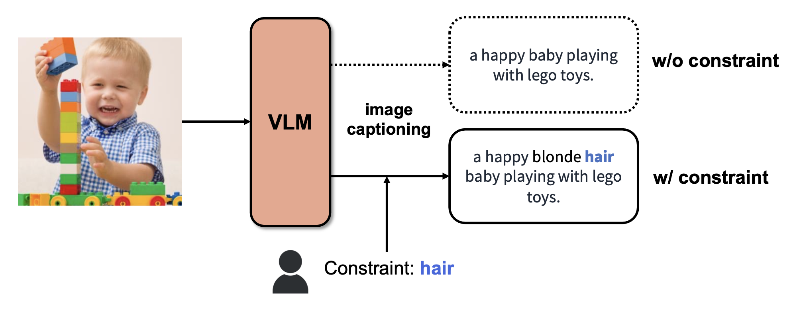

[](https://classroom.github.com/a/RT0PS4cg)

# Constrained Image Captioning applying User Preferences

AAI3201 Fall 2023 - Final Project

## Team FutureFlow
Member: 안민용, 전재현, 강종서

## Overview


## How to run
(1) Dependencies (python 3.7)
```
pip install -r requirements.txt
```
(2-1) Test on dataset (in `data` folder)
```
python test_constrained_blip2.py
```
(2-2) Demo
```
python demo_constrained_blip2.py
```
- Access http://localhost:7860 (gradio)

## File Description
- `test_constrained_blip2.py` : constrained blip2 result for cic dataset in `./data`
    - result saved in `result.json`
- `demo_constrained_blip2.py` : demo for constrained blip2
- `generate_blip2.py` : generate code for blip (from Huggingface)
- `generate_lm.py` : generate code for language part of blip (from Hugginface)
- `constrained_beam_search.py` : constrained decoding part (from NeuroLogic Decoding)
- `topK.py`, `lexical_constraints.py` : utils for NeuroLogic Decoding

## Reference
- NeuroLogic Decoding (Lu et al.) : https://github.com/GXimingLu/neurologic_decoding